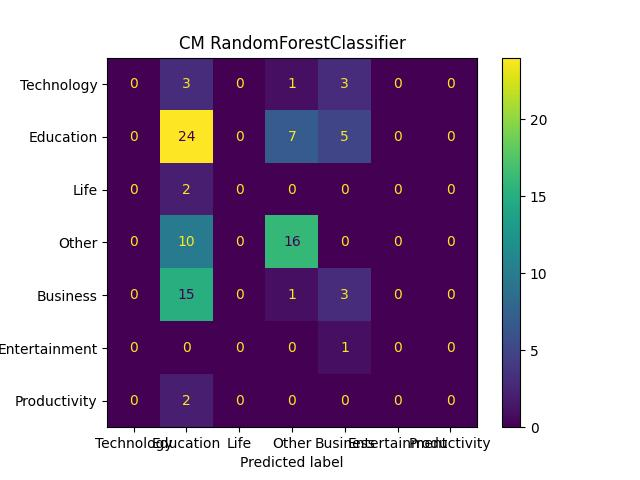

# Coding Challenge

Author: CHEN Ee Heng  
Date: 29.08.2023

Tasks:

1. Given the csv data, build a model to predict either the map rating or the map category.
2. Build a ML inferencing pipeline and deploy it on a local REST endpoint.

## 1. Task 1

We will be tackling the *map category* classification task.
This involves building a system that classifies X rows of tabular data into Y categories.
The system takes in X rows of tabular data, preprocess it, pass it through a classification model and returns one of the Y categories.

### 1.1. Data

| Column                    | Type   | Reindexed   | Original | Description |
|---------------------------|:------:|:-----------:|:--------:|---|
| map_id (UID)              | int    | X           | X        |   |
| map_title                 | str    |             | X        |   |
| map_rating                | int    |             | X        |   |
| map_category_name (label) | str    |             | X        |   |
| map_category_id   (label) | int    |             |          | Reindexed from str to int  |
| idea_id (UID)             | int    | X           | X        |   |
| idea_parent_id            | int    | X           | X        |   |
| idea_title                | str    |             | X        |   |
| idea_per_map_count        | int    |             |          | Number of ideas per map  |
| idea_parent_depth         | int    |             |          | Depth of idea based on parent idea  |
| map_title_count           | int    |             |          | Number of chars in map_title  |
| idea_title_count          | int    |             |          | Number of chars in idea_title  |
| map_title_en              | str    |             |          | Translaterd to eng  |
| idea_title_en             | str    |             |          | Translaterd to eng  |
| map_title_en_tok_bert     | floats |             |          | Bert tokens using eng translation  |
| idea_title_en_tok_bert    | floats |             |          | Bert tokens using eng translation  |
| map_title_en_emb_bert     | floats |             |          | Bert embeddings using eng translation  |
| idea_title_en_emb_bert    | floats |             |          | Bert embeddings using eng translation  |
| map_title_tok_bert        | floats |             |          | Bert tokens  |
| idea_title_tok_bert       | floats |             |          | Bert tokens  |
| map_title_emb_bert        | floats |             |          | Bert embeddings  |
| idea_title_emb_bert       | floats |             |          | Bert embeddings  |
| map_title_tok_m2m         | floats |             |          | M2M tokens  |
| idea_title_tok_m2m        | floats |             |          | M2M tokens  |
| map_title_emb_m2m         | floats |             |          | M2M encoder embeddings  |
| idea_title_emb_m2m        | floats |             |          | M2M encoder embeddings  |

### 1.2. Data ingestion and preprocess

Since there is no information or details given about the data,
we will be building the model based on what we can infer from the data:

* 7 columns (4 *map* related + 3 *idea* related).
* 1 *map* has multiple *idea*, and the *idea* is related in a tree like format.
* *idea_id* column contains UID.
* *map_title* and *idea_title* contain text in different languages.
* *map_rating* does not seem to have any meaning to it.

After some data exploration:

* there are 7 categories (Y = 7), 462 unique *map*, 13560 unique *idea*.
* each *map_title* has a unique *map_id*.
* each unique *idea_id* can share the same *idea_title*.
* *idea_parent_id* has NAN (root of tree).
* each *map* has an *idea* tree with a root.
* *map_id* has a few outliers and *idea_parent_id* is quite balanced.
* *map_title* has a few outliers and *idea_title* is quite balanced.
<!-- * *idea-wise*: *map_rating* is highly imbalanced and *map_category_name* is imbalanced. -->

Based on the above info about the data, we can conclude that:

* *map_id* column cannot be used as a feature, it is a *map* UID.
* *idea_id* column cannot be used as a feature, it is an *idea* UID.
* *idea_parent_id* column cannot be used as is since the values are *idea* UID.
* The title texts need to be encoded.
* *map_rating* should be added after initial experiments.

We will preprocess the data in the following manner:

* Reindex label to 0-6.
* Optional: Reindex ids for better processing.
* Impute NAN with 1 for *idea_parent_id*. Since it represent a tree structure, it doesnt make sense to use other imputation methods, e.g. nearest value, avg, max, min, trend.
* Remove duplicates, making sure parent idea rows (*idea_parent_id*) are not removed to maintain a continuous tree.
* Engineer new features.
* Encode the text:
  * translate all text to english and embed the text.
  * using a multilingual text tokenizer/embedding.
* Squash the M rows into N rows with unique *map_id*:
  * avg, max, min, diff
  * stack the rows into Q columns, drop if too much rows, pad with 0 if not enough.
* Drop columns: *map_id*, *map_title*, *idea_title*, *idea_id*, *idea_parent_id*
* Normailze data:
  * zero mean
  * 0-1 range

### 1.3. Classification model

We will investigate 7 classification models for this task (see [training.ipynb](./Task1/training.ipynb) for more info).
we will use the implementation from *sklearn* to train and evaluate the models.
The models will be trained using the default hyper-parameters from *sklearn*, and finetuned later.
Since the dataset is small, we will use cross validation (3-fold) to use all the training data to train the model.
The data will be split with a ratio of train:test = 8:2.
We will evaluate the models using accuracy.

All the evaluation results can be found here: [training_summary.csv](./result/training_summary.csv)
The rows have the following meanings:

* Idx        : Experiment Id
* Experiment : Experiment name with setup => {*classifier*}_{*dataset split*}
* Acc-1Fold  : Train set accuracy without cross validation.
* Acc-CV1    : Cross validation accuracy for fold 1.
* Acc-CV2    : Cross validation accuracy for fold 2.
* Acc-CV3    : Cross validation accuracy for fold 3.
* Acc-CVAvg  : Cross validation accuracy averaged over 3 folds.
* Acc-Test   : Test set accuracy.
* Time(s)    : Duration for training and evaluation.

**Top 5 highest Acc-CVAvg:**

| Idx | Experiment | Acc-1Fold | Acc-CV1 | Acc-CV2 | Acc-CV3 | Acc-CVAvg | Acc-Test | Time(s) |
|---|---|---|---|---|---|---|---|---|
|21|RandomForestClassifier_df_text_map_idea_max_split|**1** |**0.49**|**0.58**|**0.55**|**0.54**|**0.46**|2.06    |
|43|SVC_df_text_idea_max_split                       |0.66  |0.45    |0.57    |0.54    |0.52    |0.43    |1.1     |
|26|RandomForestClassifier_df_text_split             |**1** |0.46    |0.55    |0.53    |0.51    |0.39    |**0.87**|
|22|RandomForestClassifier_df_text_idea_max_split    |0.86  |0.47    |0.53    |0.5     |0.5     |0.44    |1.87    |
|44|SVC_df_text_idea_avg_split                       |0.64  |0.44    |0.54    |0.52    |0.5     |0.42    |1.18    |

**Top 5 highest Acc-Test:**

| Idx | Experiment | Acc-1Fold | Acc-CV1 | Acc-CV2 | Acc-CV3 | Acc-CVAvg | Acc-Test | Time(s) |
|---|---|---|---|---|---|---|---|---|
|4 |MLPClassifier_df_feat_text_split                 |0.95  |0.39    |0.43    |0.46    |0.43    |**0.47**|3.39    |
|5 |MLPClassifier_df_text_split                      |0.96  |0.42    |0.42    |0.43    |0.43    |**0.47**|3.17    |
|36|KNeighborsClassifier_df_text_idea_max_split      |0.58  |0.47    |0.53    |0.46    |0.49    |0.46    |**0.42**|
|1 |MLPClassifier_df_text_idea_max_split             |0.86  |0.45    |0.47    |0.52    |0.48    |0.44    |5.41    |

We can make the following observations based on the 2 tables:

* *RandomForestClassifier_X* has *Acc-1Fold* of 1, suggesting that the dataset is small and the model has overfit to the data.
* *RandomForestClassifier_X* (3/5) shows the best *Acc-CVAvg* but not always the best *Acc-Test* (1/5), suggesting it has some generalization problem.
* *MLPClassifier_X* (3/5) shows the best *Acc-Test* despite not having the best *Acc-CVAvg* (0/5), suggesting it has better generalization.
* Experiment 21 showed the best *Acc-CVAvg* (0.54) and *Acc-Test* (0.46).
* When looking at the confusion matrix for experiment 21, we can see that the classifier has a biased towards *Education* class. Surprisingly, the classifier struggles with *Business* class despite the higher amount of sample in the data. Since classifier is only trained with the encoded *X_title*, it suggests that either the *X_title* texts are relatively generic and not distinct enough, or *X_title* for *Business* and *Education* are very similar (e.g.: work-related).


**RandomForestClassifier with selected encoded text features:**

| Idx | Experiment | Acc-1Fold | Acc-CV1 | Acc-CV2 | Acc-CV3 | Acc-CVAvg | Acc-Test | Time(s) |
|---|---|---|---|---|---|---|---|---|
|0 |RandomForestClassifier_df_text_map_idea_max_m2m_emb_split    |1  |0.46    |0.54    |0.54    |0.51    |**0.52**|1       |
|1 |RandomForestClassifier_df_text_map_idea_max_m2m_tok_split    |1  |0.43    |0.51    |0.47    |0.47    |0.44    |1.42    |
|2 |RandomForestClassifier_df_text_map_idea_max_m2m_split        |1  |0.47    |0.54    |**0.57**|**0.53**|0.51    |1.05    |
|3 |RandomForestClassifier_df_text_map_idea_max_bert_emb_split   |1  |0.48    |0.56    |0.54    |**0.53**|0.4     |1.01    |
|4 |RandomForestClassifier_df_text_map_idea_max_bert_tok_split   |1  |0.42    |0.53    |0.46    |0.47    |0.45    |**0.7** |
|5 |RandomForestClassifier_df_text_map_idea_max_bert_split       |1  |0.48    |0.56    |0.51    |0.52    |0.45    |0.94    |
|6 |RandomForestClassifier_df_text_map_idea_max_bert_en_emb_split|1  |0.46    |0.56    |0.55    |0.52    |0.48    |0.92    |
|7 |RandomForestClassifier_df_text_map_idea_max_bert_en_tok_split|1  |0.46    |0.48    |0.46    |0.47    |0.4     |0.71    |
|8 |RandomForestClassifier_df_text_map_idea_max_bert_en_split    |1  |**0.49**|**0.58**|0.53    |**0.53**|0.43    |0.94    |
|---|---|---|---|---|---|---|---|---|
|21|RandomForestClassifier_df_text_map_idea_max_split            |*1*|*0.49*  |*0.58*  |*0.55*  |*0.54*  |*0.46*  |*2.06*  |

The above table is shows the result of manual feature selection.
It compares using either tokens, embedding or token + embedding as features,
and between the different LLM models.
The experiments in the previous 2 tables uses all of them as features.
We can see here, experiment 2 shows the best *Acc-CVAvg* (0.53) and *Acc-Test* (0.51).

### 1.4. Todos

The following are the things that are not implemented:

* The title texts contain escape sequences (\n, \r) that should be handled separately.
* BERT/M2M encoding assumes 512/1024 token length that should be adjusted.
* The *map_rating* is not used as a features in the model training.
* The models are trained with default configurations and not fine-tuned, see the last section of [trainig.ipynb](./Task1/trainig.ipynb) for more info.
* More detailed analysis of the results is needed.

## 2. Task 2

We will build a ML inference pipeline using a model from Task 1 and deploy it using fastapi.

What is done here:

* [inference.py](./Task2/inference.py) : The entire ML pipeline is wrapped in the Classifier class.
* [schema.py](./Task2/schema.py) : Some predefined data formats.
* [app.py](./Task2/app.py) : Main code to run fastapi. Include assertion error handling.
* [run_server.ps1](./Task2/run_server.ps1) : Script to start the server.

Fastapi comes with the swagger UI.
If we navigate to docs, we can poist our request and obtain a response from the server.
The followings are some sample requests.

Sample input:

```json
{
  "input_data": [
    {
      "map_id": 0,
      "map_title": "string",
      "idea_title": "string"
    }
  ],
  "return_label_ids": true,
  "convert_label_id_to_name": true
}
```

Sample output:

```json
{
  "status_code": 200,
  "prediction": "Other",
  "label_id": {
    "0": "Technology",
    "1": "Education",
    "2": "Life",
    "3": "Other",
    "4": "Business",
    "5": "Entertainment",
    "6": "Productivity"
  }
}
```
